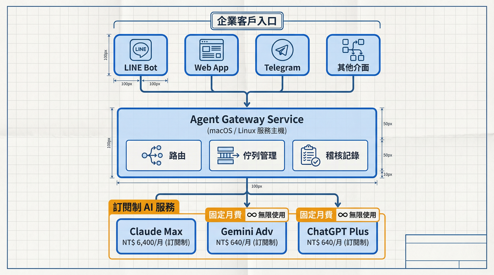
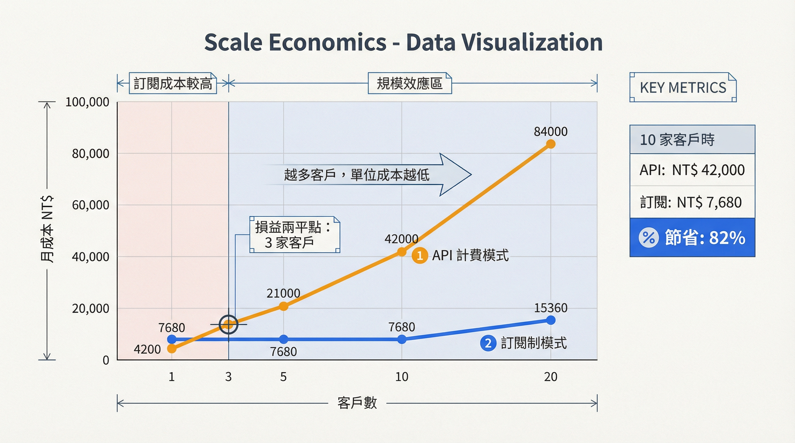
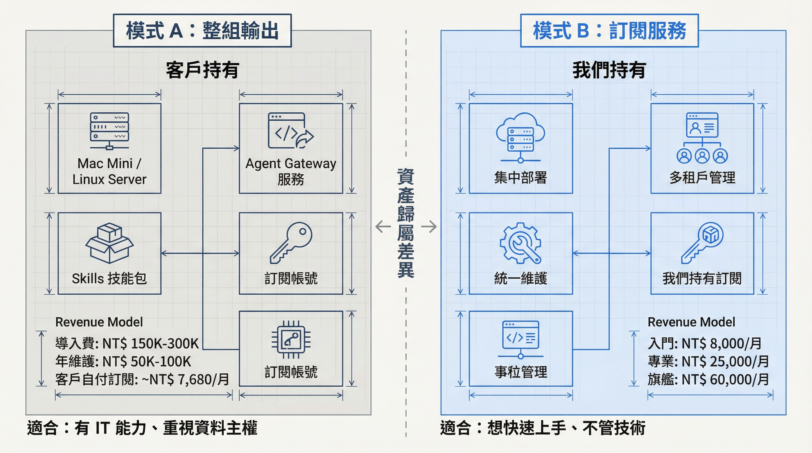
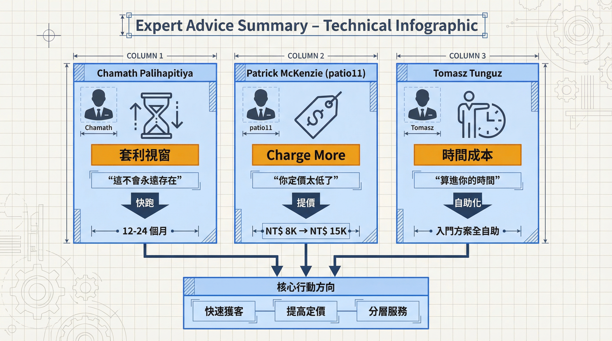

# AI Agent 魔法工具箱：成本秘訣

> **機密文件** - 僅供深度參與人員閱讀

本文件為 [ai-agent-toolbox-for-sme-report.md](./ai-agent-toolbox-for-sme-report.md) 的延伸附錄。

---

## 核心洞察

**傳統 AI 服務商的成本結構**：
```
每次 API 呼叫 × Token 數量 × 單價 = 成本隨用量線性成長
```

**我們的成本結構**：
```
固定訂閱費 ÷ 服務客戶數 = 邊際成本趨近於零
```

---

## 架構設計

### 系統架構圖

```
┌─────────────────────────────────────────────────────────────────┐
│                        企業客戶入口                              │
├─────────────┬─────────────┬─────────────┬─────────────────────────┤
│   LINE Bot  │   Web App   │  Telegram   │    其他聊天介面         │
└──────┬──────┴──────┬──────┴──────┬──────┴───────────┬─────────────┘
       │             │             │                  │
       └─────────────┴─────────────┴──────────────────┘
                              │
                              ▼
┌─────────────────────────────────────────────────────────────────┐
│                    Agent Gateway Service                        │
│               (macOS / Linux 服務主機)                           │
├─────────────────────────────────────────────────────────────────┤
│  • 接收各管道請求                                                 │
│  • 路由到對應 Skills                                              │
│  • 管理執行佇列與優先順序                                          │
│  • 記錄與稽核                                                     │
└─────────────────────────────────────────────────────────────────┘
                              │
                              ▼
┌─────────────────────────────────────────────────────────────────┐
│                    Claude Agent SDK                             │
├─────────────────────────────────────────────────────────────────┤
│  • 連接 Claude Code CLI                                          │
│  • 執行 Skills                                                   │
│  • 管理對話 context                                               │
│  • 處理工具呼叫                                                   │
└─────────────────────────────────────────────────────────────────┘
                              │
                              ▼
┌─────────────────────────────────────────────────────────────────┐
│                      訂閱制 AI 服務                              │
├─────────────────┬─────────────────┬─────────────────────────────┤
│  Claude Pro/Max │   Gemini Adv    │    ChatGPT Plus/Pro         │
│   (訂閱制)       │    (訂閱制)      │      (訂閱制)               │
└─────────────────┴─────────────────┴─────────────────────────────┘
```



---

## 成本比較

### 情境：中型客戶，每月 1,000 次 AI 互動

#### 傳統 API 計費模式

| 項目 | 計算 | 月成本 |
|------|------|--------|
| Claude API (Sonnet) | 1,000 次 × 平均 3K input + 1K output tokens | ~NT$ 3,000 |
| OpenAI API (GPT-4o) | 備援 200 次 × 平均 3K input + 1K output | ~NT$ 800 |
| 圖片生成 (DALL-E/Imagen) | 100 張 × $0.04-0.08 | ~NT$ 400 |
| **合計** | | **~NT$ 4,200** |

#### 訂閱制模式（我們的方法）

| 項目 | 月成本 | 備註 |
|------|--------|------|
| Claude Max | NT$ 6,400 (US$200) | 無限對話，含 Claude Code |
| Gemini Advanced | NT$ 640 (US$20) | 圖片生成、備援 |
| ChatGPT Plus | NT$ 640 (US$20) | 備援、特定任務 |
| **合計** | **NT$ 7,680** | |

### 關鍵差異：規模效應

| 服務客戶數 | API 模式月成本 | 訂閱模式月成本 | 訂閱模式單客成本 |
|------------|----------------|----------------|------------------|
| 1 家 | NT$ 4,200 | NT$ 7,680 | NT$ 7,680 |
| 3 家 | NT$ 12,600 | NT$ 7,680 | NT$ 2,560 |
| 5 家 | NT$ 21,000 | NT$ 7,680 | NT$ 1,536 |
| 10 家 | NT$ 42,000 | NT$ 7,680 | NT$ 768 |
| 20 家 | NT$ 84,000 | NT$ 15,360* | NT$ 768 |

> *20 家可能需要 2 組訂閱來分散負載



### 毛利分析

以「入門方案 NT$ 8,000/月」為例：

| 客戶數 | 月營收 | 訂閱成本 | 毛利 | 毛利率 |
|--------|--------|----------|------|--------|
| 3 家 | NT$ 24,000 | NT$ 7,680 | NT$ 16,320 | 68% |
| 5 家 | NT$ 40,000 | NT$ 7,680 | NT$ 32,320 | 81% |
| 10 家 | NT$ 80,000 | NT$ 7,680 | NT$ 72,320 | 90% |

---

## 技術實作要點

### Claude Agent SDK 核心能力

```typescript
// 概念示意（非實際程式碼）
interface AgentGateway {
  // 接收外部請求
  receiveRequest(source: 'line' | 'web' | 'telegram', payload: Request): void

  // 路由到對應 Skill
  routeToSkill(skillName: string, context: Context): Promise<Result>

  // 執行並返回
  executeAndRespond(skill: Skill, input: Input): Promise<Output>
}
```

### 關鍵技術決策

| 決策 | 選擇 | 理由 |
|------|------|------|
| 執行環境 | macOS / Linux | Claude Code 原生支援 |
| SDK | Claude Agent SDK | 官方支援，可控制 Claude Code |
| 佇列管理 | 自建 | 控制並發，避免訂閱限制 |
| 多租戶隔離 | Skill 層級 | 每客戶獨立 Skill 目錄 |

### 訂閱限制與應對

| 限制 | 應對策略 |
|------|----------|
| Claude Max 對話長度 | 長任務拆分，context 管理 |
| 並發請求 | 佇列 + 優先順序 + 多帳號分流 |
| 圖片生成額度 | Gemini 為主，Claude/DALL-E 備援 |
| 服務中斷 | 多供應商備援（Claude → Gemini → OpenAI） |

---

## 兩種交付模式

### 模式 A：整組輸出（賣斷）

```
┌─────────────────────────────────────────────────────────────────┐
│  交付給客戶                                                      │
├─────────────────────────────────────────────────────────────────┤
│  • Mac Mini / Linux Server（客戶自備或代購）                      │
│  • Agent Gateway 服務（安裝設定）                                 │
│  • Skills 技能包（客製化）                                        │
│  • 訂閱帳號設定指引（客戶自行訂閱）                                │
│  • 操作手冊 + 維護 SOP                                           │
└─────────────────────────────────────────────────────────────────┘

定價建議：
• 導入費：NT$ 150,000 - 300,000（依複雜度）
• 年度維護費：NT$ 50,000 - 100,000（選購）
• 客戶自付訂閱：~NT$ 7,680/月

適合：有 IT 能力、重視資料主權的中大型客戶
```

### 模式 B：訂閱服務（SaaS）

```
┌─────────────────────────────────────────────────────────────────┐
│  我們維運                                                        │
├─────────────────────────────────────────────────────────────────┤
│  • Agent Gateway 集中部署                                        │
│  • 多租戶管理                                                    │
│  • 訂閱帳號我們持有                                               │
│  • 24/7 監控與維護                                               │
└─────────────────────────────────────────────────────────────────┘

定價建議：
• 入門：NT$ 8,000/月
• 專業：NT$ 25,000/月
• 旗艦：NT$ 60,000/月

適合：想快速上手、不想管技術的中小企業
```



---

## 風險與緩解

| 風險 | 影響 | 緩解措施 |
|------|------|----------|
| 訂閱條款變更 | 成本結構改變 | 多供應商備援、關注條款更新 |
| 服務限制收緊 | 無法服務足夠客戶 | 預留擴充帳號、分散負載 |
| 技術路線變化 | SDK/CLI 不再支援 | 抽象層設計，可替換底層 |
| 合規疑慮 | 訂閱轉售爭議 | 明確服務定位為「技術服務」非「轉售」|

### 合規聲明建議

> 「我們提供的是 AI 技術整合服務，包含系統建置、流程設計、Skills 開發與維運支援。AI 模型由客戶透過我們協助設定的訂閱帳號使用，或由我們以技術服務形式代為處理。」

---

## 專家挑戰：冷水與修正

> 本節基於 Chamath Palihapitiya、Patrick McKenzie (patio11)、Tomasz Tunguz 三位專家視角的挑戰與建議。

### 挑戰一：這是有時間限制的套利視窗（Chamath）

> *「你發現了一個套利機會：訂閱制 AI 服務的定價沒有考慮到 B2B 轉售。這不會永遠存在。」*

**視窗風險**：

| 可能的封堵方式 | 時間預估 | 影響程度 |
|----------------|----------|----------|
| 修改條款禁止商業用途 | 6-18 個月 | 致命 |
| 限制 API/CLI 呼叫頻率 | 3-12 個月 | 嚴重 |
| 推出官方 B2B 方案（更便宜） | 12-24 個月 | 中等 |
| 價格調漲 | 隨時 | 可控 |

**應對策略**：

```
┌─────────────────────────────────────────────────────────────────┐
│  視窗期策略（12-24 個月）                                         │
├─────────────────────────────────────────────────────────────────┤
│                                                                 │
│  Phase 1：快速獲客                                               │
│  ────────────────                                               │
│  • 用成本優勢提供超值服務                                          │
│  • 目標：6 個月內達 20+ 付費客戶                                   │
│                                                                 │
│  Phase 2：建立黏性                                               │
│  ────────────────                                               │
│  • 累積客戶的 Skills、模板、使用習慣                               │
│  • 目標：客戶切換成本 > 3 個月營收                                 │
│                                                                 │
│  Phase 3：轉換護城河                                             │
│  ────────────────                                               │
│  • 護城河從「成本」轉向「關係 + 資產」                              │
│  • 準備 Plan B：API 計費模式的定價方案                             │
│                                                                 │
└─────────────────────────────────────────────────────────────────┘
```

> **核心認知**：套利的利潤不是護城河，客戶關係才是。成本優勢是建立真正護城河的資本。

---

### 挑戰二：你定價太低了（patio11）

> *「你以為你在賣『便宜的 AI 服務』，但你真正在賣的是『不需要理解 AI 就能用 AI』的能力。」*

**定價思維錯誤**：

| 錯誤思維 | 正確思維 |
|----------|----------|
| 基於成本定價 | 基於客戶願意付多少解決問題 |
| NT$ 8,000 = 老闆不用問老婆 | NT$ 8,000 = 不被認真對待 |
| 便宜是優勢 | 便宜是跟自己競爭 |

**修正後定價建議**：

| 方案 | 原定價 | 修正定價 | 理由 |
|------|--------|----------|------|
| 入門 | NT$ 8,000 | NT$ 15,000 | 全自助，但價格要能被認真對待 |
| 專業 | NT$ 25,000 | NT$ 45,000 | 含人力服務，覆蓋時間成本 |
| 旗艦 | NT$ 60,000 | NT$ 100,000+ | 客製化，利潤來源 |

**成本優勢的正確用法**：

```
✗ 用來降價
✓ 用來提供競爭對手無法提供的服務等級
```

例如：
- 「導入第一個月，我們每天檢視 AI 輸出品質」
- 「無限次數的 Skills 調整，直到你滿意」
- 「專屬客服群組，2 小時內回應」

這些如果用 API 計費會虧錢，但訂閱制可以做。

---

### 挑戰三：你漏算了最重要的成本——你的時間（Tomasz）

> *「你的毛利分析漏掉了最重要的成本：你的時間。」*

**原本的毛利分析（有問題）**：

| 客戶數 | 月營收 | 訂閱成本 | 毛利 | 毛利率 |
|--------|--------|----------|------|--------|
| 10 家 | NT$ 80,000 | NT$ 7,680 | NT$ 72,320 | **90%** |

**真正的單位經濟學**（假設時薪 NT$ 1,500）：

| 項目 | 入門方案客戶（原價 8K） | 入門方案客戶（修正價 15K） |
|------|------------------------|---------------------------|
| 月營收 | NT$ 8,000 | NT$ 15,000 |
| 訂閱成本分攤（10 客戶） | NT$ 768 | NT$ 768 |
| 客服時間（3 hr/月） | NT$ 4,500 | NT$ 4,500 |
| 維護時間（1 hr/月） | NT$ 1,500 | NT$ 1,500 |
| **實際毛利** | **NT$ 1,232** | **NT$ 8,232** |
| **實際毛利率** | **15%** | **55%** |

**導入成本（一次性）**：

| 項目 | 時數 | 成本 |
|------|------|------|
| 流程盤點 | 4 hr | NT$ 6,000 |
| 文件收集與設定 | 4 hr | NT$ 6,000 |
| 環境設定 | 4 hr | NT$ 6,000 |
| 教育訓練 | 4 hr | NT$ 6,000 |
| 上線調整 | 4 hr | NT$ 6,000 |
| **合計** | **20 hr** | **NT$ 30,000** |

**損益兩平分析**：

| 方案 | 導入費建議 | 月費 | 回收導入成本月數 |
|------|------------|------|------------------|
| 入門（全自助） | NT$ 0 | NT$ 15,000 | 立即（無導入服務） |
| 專業 | NT$ 50,000 | NT$ 45,000 | 導入費已覆蓋 |
| 旗艦 | NT$ 100,000 | NT$ 100,000 | 導入費已覆蓋 |

---

### 修正後的服務分層設計

```
┌─────────────────────────────────────────────────────────────────┐
│  入門方案 NT$ 15,000/月                                          │
│  ─────────────────────                                          │
│  • 全自助：客戶自己上傳文件、自己設定                               │
│  • 我們只提供：文件、影片教學、FAQ                                 │
│  • 人力介入：0                                                   │
│  • 目標毛利率：80%+                                              │
├─────────────────────────────────────────────────────────────────┤
│  專業方案 NT$ 45,000/月 + 導入費 NT$ 50,000                       │
│  ─────────────────────                                          │
│  • 含人力服務：導入顧問、每月檢視、即時支援                          │
│  • 3 個流程技能 + 客製模板                                        │
│  • 人力介入：~8 hr/月                                            │
│  • 目標毛利率：50-60%                                            │
├─────────────────────────────────────────────────────────────────┤
│  旗艦方案 NT$ 100,000+/月 + 導入費 NT$ 100,000+                   │
│  ─────────────────────                                          │
│  • 全客製：專屬 Skills 開發、系統整合                               │
│  • 專案制定價，按複雜度報價                                        │
│  • 這是利潤來源                                                   │
│  • 目標毛利率：40-50%                                            │
└─────────────────────────────────────────────────────────────────┘
```

---

### 三位專家的核心訊息

| 專家 | 核心訊息 | 行動 |
|------|----------|------|
| **Chamath** | 這是有時間限制的套利視窗 | 快跑，在視窗關閉前建立客戶基礎 |
| **patio11** | 定價太低，charge more | 提高定價，用成本優勢提供更好服務 |
| **Tomasz** | 算進你的時間成本 | 入門方案全自助，專業以上才有人力 |



---

### Plan B：當訂閱制不能用了

如果 Anthropic/OpenAI/Google 封堵訂閱轉服務的漏洞：

| 情境 | 應對 |
|------|------|
| 條款禁止商業用途 | 切換到 API 計費，調整定價 |
| 頻率限制收緊 | 多帳號分流 + 降低服務密度 |
| 推出官方 B2B 方案 | 評估是否轉為官方方案代理商 |

**API 計費模式的備案定價**：

| 方案 | 訂閱制定價 | API 計費定價 | 漲幅 |
|------|------------|--------------|------|
| 入門 | NT$ 15,000 | NT$ 25,000 | +67% |
| 專業 | NT$ 45,000 | NT$ 70,000 | +56% |
| 旗艦 | NT$ 100,000 | NT$ 150,000 | +50% |

> **提前溝通**：在視窗期就讓客戶知道「我們持續優化成本結構，未來價格可能調整」，降低調漲時的衝擊。

---

## 競爭優勢總結

| 優勢 | 說明 |
|------|------|
| **成本可控** | 固定訂閱，不怕客戶用量暴增 |
| **毛利可觀** | 5 家以上客戶達 80%+ 毛利率 |
| **技術門檻** | Agent SDK + Skills 整合需要專業 |
| **切換成本** | 客戶的 Skills 與設定都在我們這 |
| **彈性擴充** | 加訂閱帳號即可擴充容量 |

---

## 下一步行動

1. **驗證技術可行性**
   - [ ] 部署 Claude Agent SDK 測試環境
   - [ ] 實作 LINE Bot → Agent Gateway → Claude Code 串接
   - [ ] 測試並發負載與訂閱限制邊界

2. **設計多租戶架構**
   - [ ] Skill 隔離機制
   - [ ] 客戶資料分離
   - [ ] 使用量追蹤與計費

3. **建立備援機制**
   - [ ] Gemini 備援路徑
   - [ ] OpenAI 備援路徑
   - [ ] 自動切換邏輯

---

## 機密提醒

本文件內容包含商業敏感資訊：

- **不可公開**：成本結構、毛利分析、定價策略
- **不可透露給客戶**：我們使用訂閱制而非 API 的事實
- **對外說法**：「我們有自己的 AI 基礎設施與最佳化技術」

---

*最後更新：2026-01-28*
*專家挑戰章節新增：2026-01-28*
